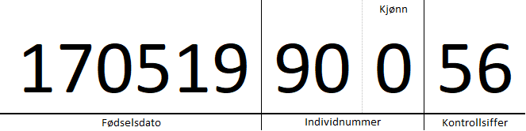

# Fødselsnummer, D-nummer og hjelpenummer

## Fødselsnummer
Et norsk fødselsnummer består av 11 siffer. De 6 første er en fødselsdato, de tre neste er et løpenummer, og de to siste er kontrollsiffer. Det tredje siste sifferet beskriver kjønn. Partall for kvinne, oddetall for mann.

## D-nummer
Et D-nummer er et fødselsnummer hvor første siffer har blit lagt på 4. Disse numrene benyttes vanligvis for arbeidsinnvandrere og andre som har behov for et personnummer for skatt, helse, osv.

## Hjelpenummer
Hjelpenummer fins i to varianter: H-nummer og FH-nummer

### H-nummer
Et H-nummer er et fødselsnummer hvor tredje siffer (måneden) har blitt lagt til 4. Dette er et virksomhetsinternt nummer, og skal ikke deles mellom virksomhetter.

### FH-nummer
Et FH-nummer er et generert nummer som starter med 8 eller 9. Her sier de 9 første sifrene ingenting om personen men er enten løpende eller tilfeldig generert. De to siste sifrene er fortsatt kontrollsiffer med samme utregning som for de andre numrene.

Bruksområde for FH-nummer er tilfeller hvor pasienter er ukjente og ikke har mulighet til å gjøre rede for seg. For eksempel traume hos turist. Noen MRS-register har mulighet for å opprette slike FH-nummer, og disse blir da registrert hos NHN PREG.

_Pr februar 2019 er status slik at systemer som bruker DIPS og systemer som bruker NHN PREG ikke har felles base for FH-nummer. Dette gjør at det kan dukke opp kollisjon mellom fødselsnummer ved import. Alle importer hvor data kommer i fra "ikke-NHN"-systemer må derfor automatisk opprette nye hjelpenummer for pasientene._
