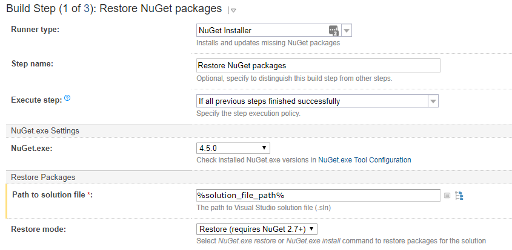
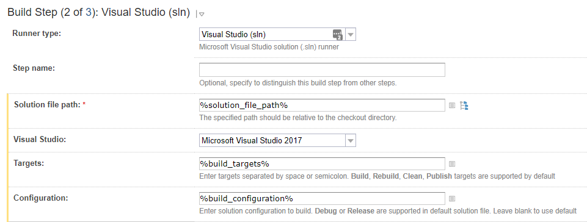
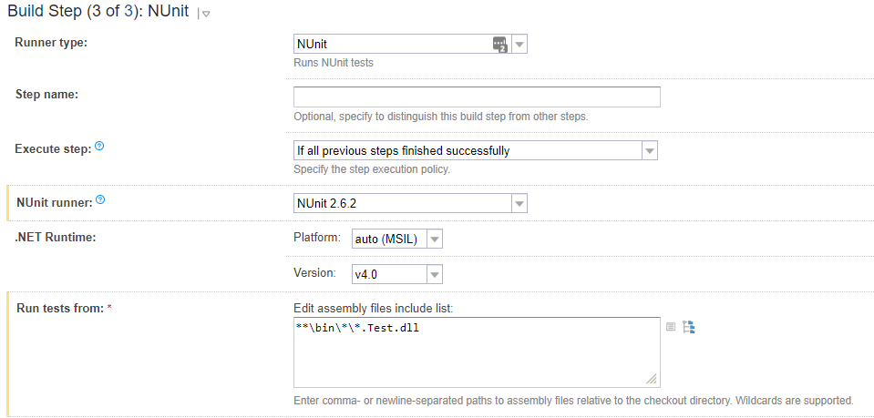
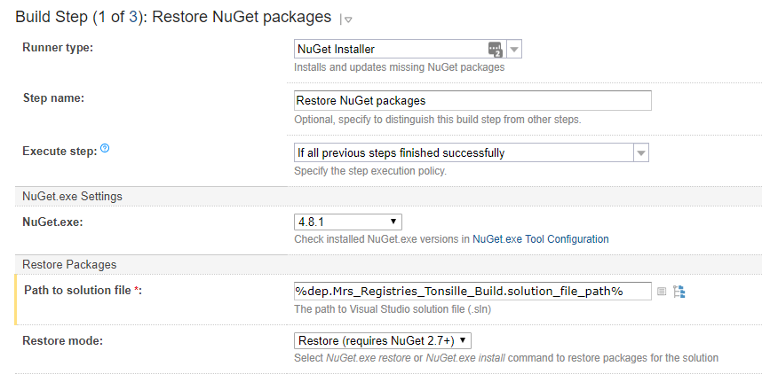
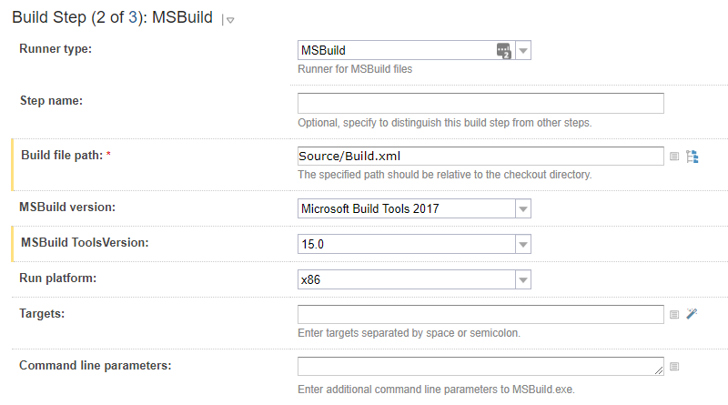

# Steg-for-steg beskrivelse for å ta et register fra v7 til v8
## Register
Bruk et register som allerede har tatt i bruk det nye regimet som mal (feks Tonsille)

1. Sammenlign hver enkelt prosjektfil (*.csproj) i mal-registeret (RegA) med tilsvarende i det som skal oppgraderes (RegB).
2. Kopier med hele `<ItemGroup>` seksjonen som inneholder PackageReference med referanser til kjerne-pakker fra RegA og legg den rett over første `<ItemGroup>` i RegB.
3. Slett alle `<Reference>` i RegB som har `<HintPath>` og referanse inn i packages
4. Slett packages.config i alle prosjektene som er oppgradert. Slett også katalogene bin og obj
5. Slett packages katalogen (under Source)
6. Kopier Directory.Build.props (under Source) fra RegA til RegB og endre versjonsnummeret som ligger i `<MqrCoreVersion>` hvis nødvendig
   - Hvis solution er åpen i Visual Studio. Lukk solution og åpne på nytt. Dette må gjøres for at den skal plukke opp endringene i Directory.Build.props. **Ved enhver endring i Directory.Build.props må løsningen åpnes på ny for at endringene skal bli registrert av VS)**
   - Dersom man opplever problemer med at build ikke finner ny versjon kan det hjelpe å "Clear all Nuget Cache(s)" i Tools -> Nuget Package Manager -> Package Manager Settings -> General
7. Erstatt NuGet.config i rotkatalogen til RegB med den fra RegA
8. Slett NugetUpdate.bat i rotkatalogen til RegB (oppdatering av kjernens nuget-pakker skjer nå gjennom Directory.Build.props og debugging av kjernekode gjøres gjennom skript som ligger i kjerne-løsningen, se [Debugging av kjernekode](kjernedebug.md))

## TeamCity
Bruk et register som allerede har tatt i bruk det nye regimet som mal (feks Tonsille).

Oppdater Build (**NB! Rekkefølgen på stegene er essensiell**):  
`Edit Project Settings -> Build (Build Configurations) -> Build Steps`

Oppdater Pack (**NB! Rekkefølgen på stegene er essensiell**):  
`Edit Project Settings -> Pack (Build Configurations) -> Build Steps`

